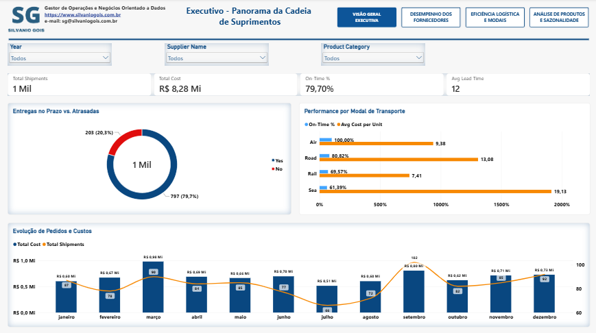
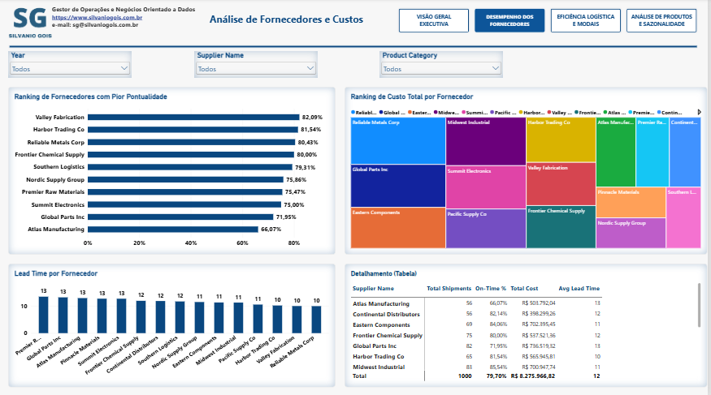
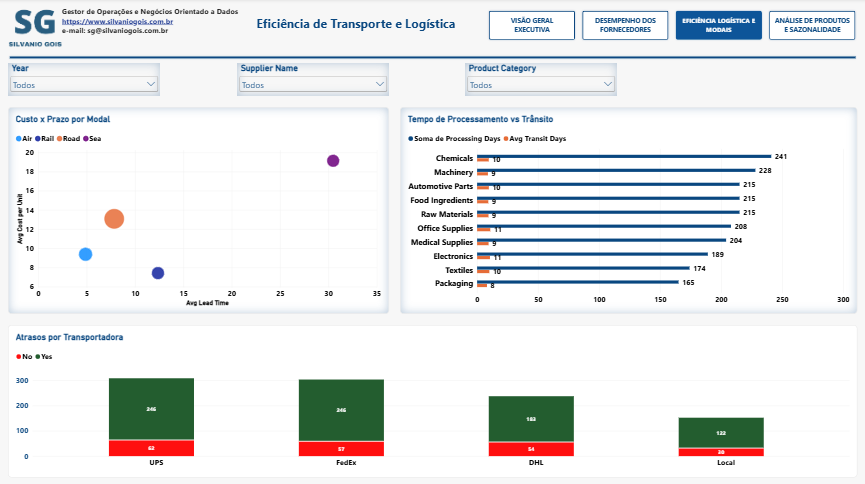
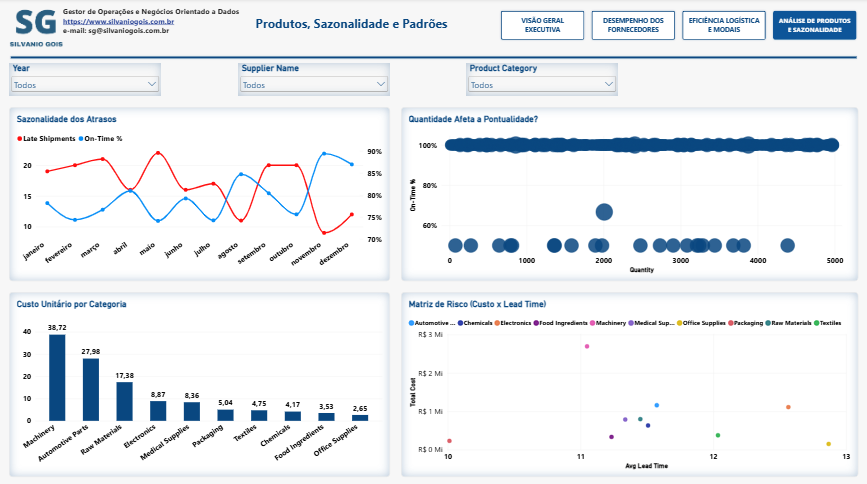

#  Dashboard de Inteligência em Supply Chain & Gestão Operacional

Apresento este projeto como uma realização pessoal que demonstra minha capacidade de transformar dados brutos em inteligência de negócio aplicada. Como **Gestor de Operações e Negócios Orientado a Dados**, minha competência neste dashboard reside na estruturação de um modelo de dados eficiente, na criação de medidas calculadas (DAX) para indicadores precisos e no desenho de uma experiência de usuário que guia o analista da visão macro para a micro, sempre com foco em Supply Chain.

O relatório foi construído para responder perguntas críticas de negócio, cobrindo desde a visão executiva até a análise granular de fornecedores, transportes e sazonalidade, permitindo uma tomada de decisão estratégica e operacional.

---

##  Páginas do Dashboard

### 1. Executivo - Panorama da Cadeia de Suprimentos
Consolida os principais KPIs da operação para responder qual é a eficiência global da operação. Ela evidencia que, de um total de **1 milhão de remessas**, temos um **custo total de R$ 8,28 milhões**, um percentual de **entregas no prazo de 79,70%**, 0,90 Mi de unidades e 102 remessas no pico de setembro, auxiliando no planejamento da capacidade logística.

---

### 2. Análise de Fornecedores e Custos
Investiga o desempenho dos parceiros, destacando os fornecedores com pior pontualidade e os custos totais envolvidos, respondendo quais são os fornecedores mais críticos em relação ao prazo e quais concentram a maior parte do custo logístico.

* **Ranking de Pontualidade Crítica:**
  * **Valley Fabrication:** 82,09%
  * **Harbor Trading Co:** 81,54%
  * **Reliable Metals Corp:** 80,43%
* **Distribuição de Custo (Treemap):** *Reliable Metals Corp*, *Global Parts Inc* e *Eastern Components* possuem os maiores blocos de gasto.
* **Análise Complementar:** Destaque para a *Atlas Manufacturing* com apenas **66,07% de pontualidade** e um **lead time de 13 dias**, evidenciando a necessidade de renegociação ou troca de parceiros estratégicos.

---

### 3. Eficiência de Transporte e Logística
Foca na análise modal e no desempenho das transportadoras, respondendo qual modal oferece o melhor equilíbrio entre custo por unidade e lead time, e quais transportadoras estão contribuindo significativamente para o número de atrasos.

* **Tempo de Trânsito e Processamento:** A categoria de *Chemicals* possui o maior tempo total (**241 dias**), seguida por *Machinery* (**228 dias**), contrastando com *Packaging* (**165 dias**).
* **Eficiência das Transportadoras:**
  * **UPS:** 265 remessas no prazo | 46 atrasadas
  * **FedEx:** 265 no prazo | 57 atrasadas *(pior índice relativo)*
  * **DHL:** 183 no prazo | 54 atrasadas

---

### 4. Produtos, Sazonalidade e Padrões
Explora a variabilidade do negócio ao longo do tempo e por portfólio. Responde se existe uma sazonalidade clara nos atrasos e quais categorias possuem os maiores custos unitários.

* **Sazonalidade:** Flutuação considerável ao longo do ano, com **pico de atrasos em março e novembro** e uma melhora drástica na pontualidade em **dezembro (atingindo quase 90%)**.
* **Volume vs. Atrasos:** O volume não é o principal driver de atrasos, mantendo uma linha de 100% de pontualidade para a maior parte das remessas (exceto por um *outlier* em 2.000 unidades).
* **Custo Unitário por Categoria:** *Machinery* (**R$ 38,72**) e *Automotive Parts* (**R$ 27,98**) são as mais caras de se transportar.
* **Matriz de Risco (Custo x Lead Time):** Identifica quais produtos apresentam alto risco combinando custo elevado e longo lead time, orientando as estratégias de estoque e planejamento de demanda.

---

##  Conclusão

O dashboard como um todo responde de forma coesa às perguntas estratégicas sobre desempenho de fornecedores, eficiência de transporte, sazonalidade de atrasos, categorias de maior risco e custo, e os principais indicadores executivos. É uma ferramenta completa que transforma dados em ações concretas, demonstrando minha proficiência em ferramentas de BI e análise descritiva e diagnóstica.

---

## 📁 Arquivos do Projeto

- `Dasboard-SupplyChain.pbix` (Arquivo do Power BI)
- `Dasboard-SupplyChain.pdf` (Relatório em PDF)
- `SupplyChain.xlsx` (Base de dados original)

---

##  Autor

**Silvanio Gois** – *Gestor de Operações e Negócios Orientado a Dados*

-  [Website Oficial](https://www.silvaniogois.com.br/)
-  [LinkedIn](https://www.linkedin.com/in/silvanio-gois/)
-  [GitHub](https://github.com/SilvanioSG)
-  [Projeto Interativo no Power BI Service](https://app.powerbi.com/view?r=eyJrIjoiZmU4NzYyZmEtMDVjOS00NDdmLWExNGQtNTgwOWZhMWUxMjRkIiwidCI6IjJlYmQyYzU0LWY1ZDMtNGVmYi05ZGE3LWU4Yzk0YmQyMWQzOSJ9)
